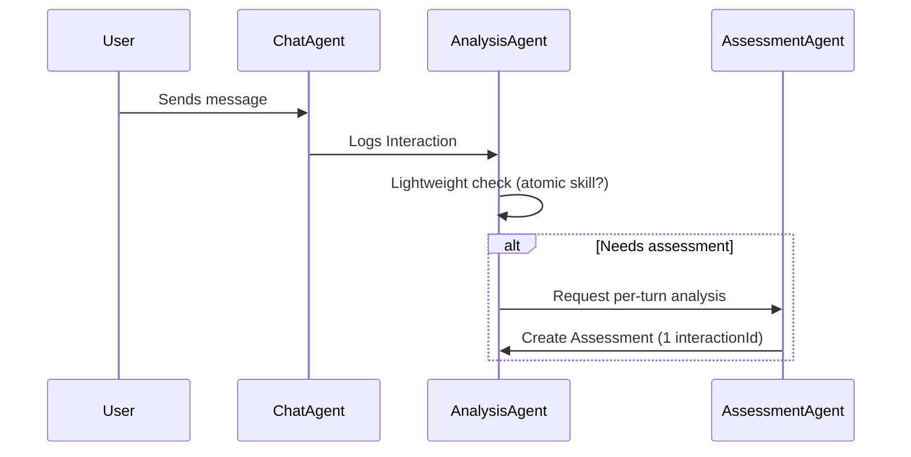
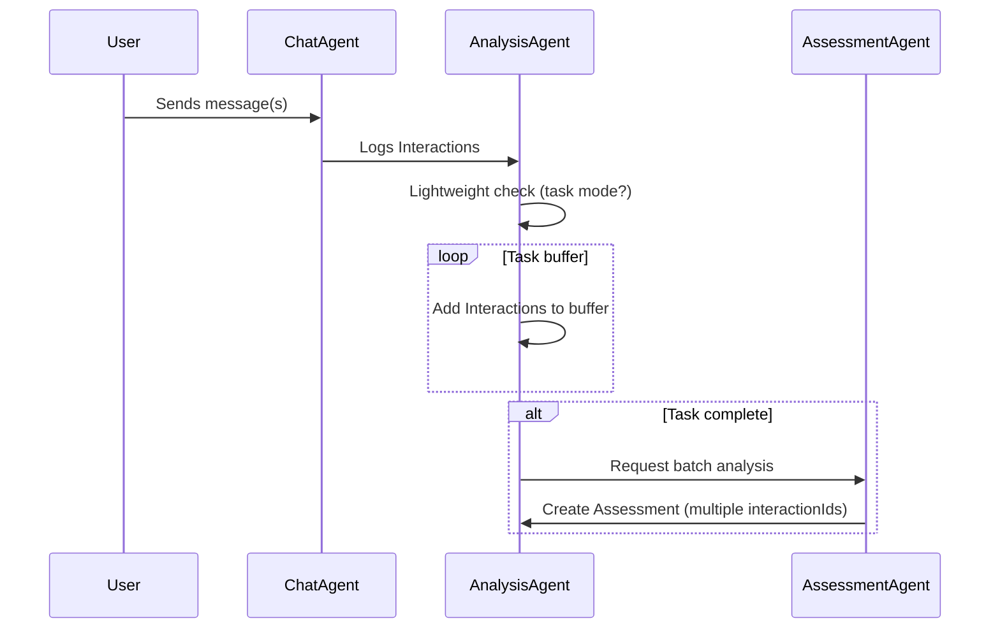

# Coach Up: Technical Plan & Architecture

This document provides a comprehensive technical overview of the Coach Up system, covering data models, system architecture, assessment logic, and session management.

## 1. Core Data Models

- User – Profile info.
  - Fields: `id`, `name`, `email`

- Focus – A measurable learning goal or skill.
  - Fields: `id`, `title`, `description`

- UserSession – Continuous conversation container.
  - Fields: `id`, `userId`, `startTime`, `endTime`

- UserFocus – User-selected focuses (up to 3 active) and ordering.
  - Fields: `id`, `userId`, `focusId`, `order` (1–3), `active`, `startedAt`, `updatedAt`

- Interaction – One turn in chat.
  - Fields: `id`, `sessionId`, `userText`, `aiResponse`, `timestamp`

- Assessment – Structured feedback, per-turn or multi-turn.
  - Fields:
    - `id`, `userId`, `sessionId`, `interactionIds[]`, `focusId`
    - `kind` ("interaction" | "multi_turn" | "session_summary")
    - `category` ("error" | "progress")
    - `score` (1–10 or null)
    - `explanationText`
    - `errors?`: `[{ key, message, severity, suggestion?, span? }]`
    - `tags?`: `string[]`
    - `groupId?`: `string` (groups per-focus assessments from the same multi-turn evaluation)
    - `rubricVersion?`: `string`
    - `createdAt`: `number`

## 2. Focus Progression (1–10 Scale)

Dynamic progression per Focus, based on aggregated Assessments:

- 1–3 Novice: Frequent errors, low scores.
- 4–7 Developing: Mixed errors and successes.
- 8–10 Mastery: Consistent strong performance.

### Level Mapping (MVP)

- Compute an EMA (exponential moving average) of `score` over the last N progress assessments for a given `focusId` (e.g., N=20, EMA α=0.3). Count only `category = "progress"`.
- Map EMA to levels:
  - 1–3: EMA < 4
  - 4–7: 4 ≤ EMA < 8
  - 8–10: EMA ≥ 8
- Use this simple mapping for explainability. Adjust thresholds later without schema changes.

## 3. Multi-Agent Architecture

- Real-Time Chat Agent
  - Fast responses, logs Interactions.

- Background Analysis Agent
  - Lightweight filter → decides if assessment is needed and scope (per-turn or multi-turn).
  - Assessment Agent → performs deep analysis and generates Assessments.

- End-of-Session Review Agent
  - Summarizes all Assessments into holistic session feedback.

## 4. Assessment Logic

### Kinds and Categories

- `kind` defines scope:
  - `interaction`: exactly one `interactionId`.
  - `multi_turn`: two or more `interactionIds`.
  - `session_summary`: no `interactionIds` (0); optional overall score/explanation.
- `category` defines purpose:
  - `error`: identifies mistakes; drives top-error aggregation.
  - `progress`: contributes to level/EMA and progression.
- Validation rules:
  - `interaction` ⇒ `interactionIds.length === 1`
  - `multi_turn` ⇒ `interactionIds.length >= 2`
  - `session_summary` ⇒ `interactionIds.length === 0`
- Grouping:
  - For one multi-turn evaluation emitting multiple per-focus assessments, set the same `groupId` on each record.

### Per-Interaction

- For atomic skills (grammar, vocabulary, tone).
- Assesses latest `userText` + `aiResponse`.

### Multi-Turn

- For multi-turn tasks requiring context (e.g., sales pitch, interview).
- Uses a short-term buffer (3–6 turns).
- Triggered when buffer is “complete” (task ends or user requests feedback).
- Produces one or more per-focus Assessments tied to the same `interactionIds` and sharing a `groupId`.

### Session Summary

- Optional overall assessment per session.
- `kind = session_summary`, `interactionIds = []`.
- May include an overall `score` and high-level `explanationText`; per-focus details remain in atomic Assessments.

### Triggers

- Error detection
- Skill attempt detection
- Periodic checks
- User request

### Indexes & Queries (Convex)

- Assessments: index by `userId`, `sessionId`, `focusId`, `kind`, `createdAt`, `groupId`.
- UserFocus: index by `userId`, `active`.
- Typical reads:
  - Last N assessments by `focusId` for dashboard/progression.
  - Latest `session_summary` by `sessionId` for post-chat view.
  - Fetch all per-focus multi_turn assessments by `groupId` for a single evaluation.

### Examples

Interaction assessment (JSON):

```json
{
  "id": "ass_1",
  "userId": "u_1",
  "sessionId": "sess_1",
  "interactionIds": ["int_9"],
  "focusId": "focus_assertiveness",
  "kind": "interaction",
  "category": "error",
  "score": null,
  "explanationText": "Past tense error.",
  "errors": [
    {"key": "past_tense", "message": "Use 'went'.", "severity": "low", "suggestion": "I went..."}
  ],
  "createdAt": 1692453123456
}
```

Multi-turn per-focus assessments tied by groupId:

```json
[
  {
    "id": "ass_2a",
    "userId": "u_1",
    "sessionId": "sess_1",
    "interactionIds": ["int_8", "int_9", "int_10"],
    "focusId": "focus_assertiveness",
    "kind": "multi_turn",
    "category": "progress",
    "score": 7,
    "explanationText": "Stronger closing ask; fewer hedges.",
    "groupId": "grp_1",
    "createdAt": 1692453124000
  },
  {
    "id": "ass_2b",
    "userId": "u_1",
    "sessionId": "sess_1",
    "interactionIds": ["int_8", "int_9", "int_10"],
    "focusId": "focus_word_choice",
    "kind": "multi_turn",
    "category": "progress",
    "score": 6,
    "explanationText": "Improved precision; avoid 'revert' for 'reply'.",
    "groupId": "grp_1",
    "createdAt": 1692453124500
  }
]
```

Session summary:

```json
{
  "id": "ass_3",
  "userId": "u_1",
  "sessionId": "sess_1",
  "interactionIds": [],
  "focusId": null,
  "kind": "session_summary",
  "category": "progress",
  "score": 7,
  "explanationText": "Clear structure; next: reduce hedging and refine word choice.",
  "createdAt": 1692453125000
}
```

## 5. Session Management

- Start: First message after inactivity → new `UserSession`.
- End: Auto-close after 15–30 minutes idle.
- Ensures self-contained, analyzable sessions.

## 6. Sequence Diagrams

### a) Per-Interaction Assessment



### b) Multi-Turn Assessment



## 7. Benefits

- Scalable: Filters prevent unnecessary LLM calls.
- Targeted: Feedback tied to actual skill attempts.
- Flexible: Supports per-turn micro feedback and multi-turn macro evaluation.
- User-Centric: Inline corrections + holistic scenario reviews.

## 8. Tech Stack

### Key Components of the Tech Stack

- Next.js for the frontend and backend (App Router, Server Actions, API Routes).
- Convex for the database with real-time updates and end-to-end type safety in TypeScript.
- Clerk for authentication and billing.
- shadcn/ui and Tailwind CSS for the user interface.
- Vercel for hosting and edge/runtime optimizations.
- Python AI service using FastAPI.

### Integration Overview

- Next.js app handles the web UI and lightweight server logic; protected by Clerk.
- Convex stores users, sessions, interactions, assessments; real-time updates drive live UI.
- AI flows are delegated to a Python FastAPI service.
- Next.js API routes call the Python service for real-time chat assistance and background assessments.
- Streaming responses: server-sent events/Web Streams from Python → Next.js → client.
- Deployed on Vercel; Convex manages its own infrastructure; Python service deployed as a separate service (e.g., Vercel partner integration or container host).
- For the MVP chat streaming implementation plan, see sprint: [SPR-001 — MVP Chat Core](../ops/sprints/SPR-001.md).
 
```mermaid
flowchart LR
  UI[Next.js + shadcn/ui + Tailwind] --> API[Next.js API Routes]
  API -->|Auth| Clerk[Clerk]
  API --> Convex[(Convex DB)]
  API --> Py[Python FastAPI]
  Py --> LLM[LLM Provider(s)]
  Convex <-->|RT updates| UI
  API -.deploy.-> Vercel[Vercel Hosting]
```

## 9. Operational Notes

### 9.1 Service-to-Service Auth

- Next.js → FastAPI: verify Clerk JWT in FastAPI (issuer, audience, JWKS cache).
- Propagate a requestId header from client → Next.js → FastAPI; include in all logs.
- Allow anonymous read-only health checks; require auth for AI/chat endpoints.

### 9.2 Observability & Tracing

- Structured JSON logs in both services with fields: `ts`, `level`, `requestId`, `userId`, `sessionId`, `groupId?`, `focusId?`, `route`, `latencyMs`.
- Emit counters/timers for p95 latency and error rates per endpoint and provider.
- Add simple trace IDs now; optional OpenTelemetry later to stitch Next.js ↔ FastAPI.

### 9.3 Rate Limiting & Backoff

- Per-user quotas: turns/min, audio seconds/day, concurrent streams.
- Client-visible 429 with retry-after; exponential backoff for transient provider errors.
- Guardrails on audio upload size/type and maximum session duration.

### 9.4 Vendor Abstraction & Reproducibility

- Define thin interfaces: `ChatProvider`, `STTProvider`, `TTSProvider` with `provider` and `modelId`.
- Feature-flag provider swaps; keep prompt/rubric text versioned (`rubricVersion`).
- Prefer keeping Assessment lean; for full reproducibility, add a minimal PromptRun log (optional, background written):

PromptRun (optional, not a core dependency):

```json
{
  "id": "pr_1",
  "requestId": "req_123",
  "userId": "u_1",
  "sessionId": "sess_1",
  "interactionIds": ["int_8", "int_9"],
  "groupId": "grp_1",
  "provider": "openai",
  "modelId": "gpt-4o-mini",
  "rubricVersion": "v1",
  "inputTokens": 1200,
  "outputTokens": 350,
  "latencyMs": 820,
  "costCents": 1.9,
  "status": "ok",
  "createdAt": 1692453123456
}
```

Indexes: by `requestId`, `userId`, `sessionId`, `groupId`, `createdAt`.

### 9.5 Budgets, Alerts, and Privacy

- Budget alarms per provider/model; circuit-breaker to a cheaper model on threshold.
- Alert on p95 > targets, STT/TTS failure rates, timeouts, and queue backlog.
- Privacy: short retention window for raw audio, encryption at rest/in transit, and strict bucket policies.

## 10. Performance & Monitoring

See Monitoring doc for headers, metrics, and log formats: [Monitoring & Observability](../ops/monitoring.md).

### 10.1 SLOs & Budgets (MVP)

- Realtime chat (text): p95 time-to-first-token < 1.2s; p95 full-turn < 2.5s; error rate < 1%.
- Realtime chat (TTS): p95 audio start < 1.8s.
- Background multi-turn assessment: p95 completion < 8s; success ≥ 99%.
- Session summary generation: p95 < 3s.
- Availability: 99.9% for chat/assessment endpoints (business hours).
- Cost guardrail: max cost per DAU; alert if 3-day MA exceeds threshold.

### 10.2 Metrics to Emit

- Next.js API routes
  - request.count, request.errors, request.latency_ms (histogram)
  - sse.first_token_ms, stream.duration_ms, stream.disconnects
  - provider.request.count/errors/latency_ms, tokens.in/out, cost.cents
- FastAPI (AI service)
  - mirror provider metrics; upstream_latency_ms; retries/backoff.count
- Convex
  - function.latency_ms, function.errors, query.items_returned, rate_limit.events
- Frontend RUM
  - Web Vitals (LCP, INP, CLS, TTFB), sse.stalls, audio.start_ms

Include tags when reasonable: route, provider, modelId, rubricVersion, and hashed userId/sessionId/focusId/groupId to limit cardinality.

### 10.3 Dashboards

- Realtime Chat Health: first-token and full-turn latency p50/p95, error rate, SSE disconnects, retries/timeouts.
- Background Assessments: completion latency, error rate by provider/modelId and rubricVersion, groupId batch sizes.
- Cost & Provider Health: tokens and cost by provider/modelId, fallback usage, budget headroom.

### 10.4 Alerts

- p95 chat full-turn > 2.5s for 5 min.
- Provider error rate > 3% for 5 min or 10 consecutive timeouts.
- Assessment backlog > N or p95 completion > 8s for 10 min.
- Daily cost > budget or forecasted overrun in next 24h.
- Convex function errors > 0.5% or p95 latency > 500ms.

### 10.5 Instrumentation Notes

- IDs & tracing: generate requestId at client/edge; propagate client → Next.js → FastAPI → provider; include in all logs with userId/sessionId/focusId/groupId (hashed if needed).
- Logging: structured JSON fields: ts, level, requestId, userId, sessionId, focusId?, groupId?, route, latencyMs, provider, modelId, tokensIn, tokensOut, costCents, status. Redact PII; never log raw audio/text.
- Next.js: stream replies (Web Streams), flush headers early; avoid blocking work in API routes; reuse HTTP/2 connections; cache provider clients.
- FastAPI: async endpoints; shared httpx.AsyncClient with timeouts and jittered retries; concurrency guards for fan-out; cache Clerk JWKS; verify JWT per request.
- Convex: always use indexes; paginate; avoid N+1; keep records small; denormalize small counters only if reads spike.
- Tracing: start with requestId and span-like logs; add OpenTelemetry SDKs later to emit OTLP traces.

### 10.6 Load & Chaos Tests

- k6/Locust: 20–50 concurrent chat sessions with SSE; assert SLOs and backpressure.
- Playwright: E2E happy path with timing assertions.
- Chaos: inject provider 500/timeout spikes; verify fallback and alerts.

## 11. Benchmarking & LLM Provider Evaluation

Purpose
- Compare providers/models on quality, latency (TTFT and full turn), cost, robustness, and safety.

Approach (MVP)
- Offline: golden dataset (200–300 items) per task type; judge via rubric (pairwise) plus heuristics; aggregate with win rates and cost/latency.
- Online: A/B via feature flags; sticky bucketing per user/session; success = correction acceptance, rating, and latency.
- Provider matrix: small fast model for realtime; larger model for background; define a cheaper fallback with circuit breaker.

Artifacts & Logging
- Log PromptRun with requestId, provider/modelId, rubricVersion, tokens, cost, latency.
- Emit provider metrics and add a simple “Benchmark Results” dashboard.

See the detailed guide: [Benchmarking & LLM Provider Evaluation](../ops/benchmarking.md)